# MTV Integrations - System Architecture Diagram

This diagram shows the overall system architecture and component relationships within the MTV Integrations system.

```mermaid
graph TB
    subgraph "ACM Hub Cluster"
        subgraph "MTV Integrations Namespace"
            A[MTV Integrations Controller<br/>ManagedClusterReconciler]
            B[MTV Plan Webhook<br/>/validate-plan]
            C[Certificate Manager<br/>TLS Certificates]
            D[Leader Election<br/>Coordination]
        end
        
        subgraph "openshift-mtv Namespace"
            E[Provider Secrets<br/>Authentication Data]
            F[Provider Resources<br/>MTV Registration]
        end
        
        subgraph "Managed Cluster Namespaces"
            G[ManagedServiceAccounts<br/>Token Management]
            H[ClusterPermissions<br/>cluster-admin RBAC]
        end
        
        subgraph "ACM Core Components"
            I[ManagedCluster Resources<br/>Cluster Registry]
            J[kubevirtprojects<br/>ClusterView API]
            K[ManifestWork<br/>Addon Deployment]
        end
    end
    
    subgraph "Managed Clusters"
        subgraph "Cluster 1"
            L1[CNV Operator<br/>Virtualization]
            M1[VolSync<br/>Data Replication]
            N1[Service Account<br/>Authentication]
        end
        
        subgraph "Cluster 2"
            L2[MTV Components<br/>Migration Tools]
            M2[Storage Classes<br/>Volume Management]
            N2[Kubeconfig Access<br/>API Authentication]
        end
    end
    
    subgraph "External Systems"
        O[Container Registries<br/>quay.io, registry.redhat.io]
        P[Certificate Authorities<br/>cert-manager, External CA]
        Q[Object Storage<br/>S3, PVCs, Snapshots]
        R[User Interfaces<br/>ACM Console, CLI]
    end
    
    %% Controller Relationships
    A -->|Monitors| I
    A -->|Creates/Manages| G
    A -->|Creates| H
    A -->|Creates/Updates| E
    A -->|Registers| F
    A -->|Uses| C
    A -->|Coordinates via| D
    
    %% Webhook Relationships  
    B -->|Validates| F
    B -->|Checks Access| J
    B -->|Uses| C
    R -->|Creates Plans| B
    
    %% Cross-Cluster Authentication
    G -->|Generates Tokens| E
    N1 -->|Authenticates with| E
    N2 -->|Authenticates with| E
    
    %% Addon Deployment
    K -->|Deploys| L1
    K -->|Deploys| L2
    K -->|Deploys| M1
    
    %% External Dependencies
    A -->|Pulls Images| O
    L1 -->|Pulls Images| O
    L2 -->|Pulls Images| O
    C -->|Validates| P
    M1 -->|Replicates to| Q
    M2 -->|Manages| Q
    
    %% Styling
    style A fill:#e1f5fe
    style B fill:#e8f5e8
    style E fill:#fff3e0
    style F fill:#fff3e0
    style G fill:#ffebee
    style H fill:#ffebee
    style I fill:#f3e5f5
    style J fill:#f3e5f5
    
    %% Security Annotations
    classDef sensitive fill:#ffcdd2,stroke:#d32f2f,stroke-width:2px
    classDef secure fill:#c8e6c9,stroke:#388e3c,stroke-width:2px
    classDef external fill:#e0e0e0,stroke:#757575,stroke-width:2px
    
    class E,G,H sensitive
    class B,C,P secure
    class O,Q,R external
```

## Architecture Overview

### Core Components

#### **MTV Integrations Controller**
- **Purpose**: Manages MTV provider lifecycle
- **Key Functions**: 
  - Monitors ManagedCluster resources
  - Creates ManagedServiceAccounts with token rotation
  - Manages ClusterPermissions (cluster-admin level)
  - Creates and synchronizes Provider secrets and resources

#### **MTV Plan Webhook**
- **Purpose**: Validates migration plans for access control
- **Key Functions**:
  - Validates Plan resources via admission control
  - Impersonates users for permission checking
  - Enforces namespace access using kubevirtprojects API

#### **Certificate Manager**
- **Purpose**: Manages TLS certificates for secure communications
- **Key Functions**:
  - Automatic certificate renewal and rotation
  - Webhook and metrics server TLS protection
  - Integration with cert-manager or external CAs

### Data Flow Patterns

#### **Authentication Flow**
1. Controller creates ManagedServiceAccounts
2. Service accounts generate authentication tokens (60-min rotation)
3. Tokens stored in Provider secrets
4. Managed clusters authenticate using tokens

#### **Authorization Flow**
1. User creates MTV Plan resource
2. Webhook intercepts Plan creation/updates
3. Webhook impersonates user for permission validation
4. kubevirtprojects API validates namespace access
5. Plan approved/denied based on user permissions

#### **Addon Deployment Flow**
1. Administrator labels ManagedCluster resources
2. Controller detects label changes
3. ManifestWork resources deploy CNV/MTV operators
4. Operators install on target managed clusters

### Security Boundaries

#### **Trust Zones**
- **Hub Cluster**: High trust zone with sensitive secrets and RBAC
- **Managed Clusters**: Medium trust zone with token-based authentication
- **External Systems**: Low trust zone with TLS-protected communications

#### **Privilege Levels**
- **cluster-admin**: ManagedServiceAccounts (requires mitigation)
- **Controller RBAC**: Scoped cluster-level permissions
- **User Permissions**: Validated through impersonation and ClusterView

#### **Communication Security**
- **TLS 1.3**: All webhook and API communications
- **Token Authentication**: Cross-cluster service account tokens
- **Certificate Validation**: Full certificate chain verification
