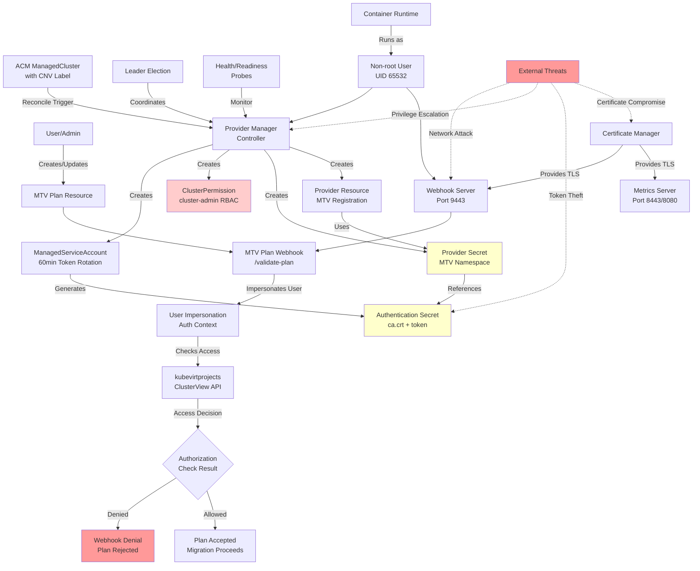

# MTV Integrations - Threat Model Data Flow Diagram

This diagram illustrates the key data flows, trust boundaries, and potential threat vectors within the MTV Integrations system.

## Diagram Legend

### Components
- **Yellow**: Sensitive secrets and authentication data
- **Light Red**: High-privilege components (cluster-admin permissions)
- **Red**: Threats and security failures
- **Blue**: Standard components and normal operations

### Trust Boundaries
1. **User → Webhook**: TLS-protected admission control
2. **Controller → Cluster APIs**: Authenticated service account access
3. **Cross-cluster**: Token-based authentication with CA validation
4. **Container Runtime**: Non-root execution with security contexts

### Key Security Controls
- Token rotation (60-minute intervals)
- TLS encryption for all communications
- RBAC-based authorization
- User impersonation for permission validation
- Certificate-based authentication
- Non-root container execution

### Threat Vectors (Dotted Red Lines)
- Network-based attacks on webhook endpoints
- Privilege escalation attempts in controllers
- Token theft from authentication secrets
- Certificate compromise for TLS bypass
